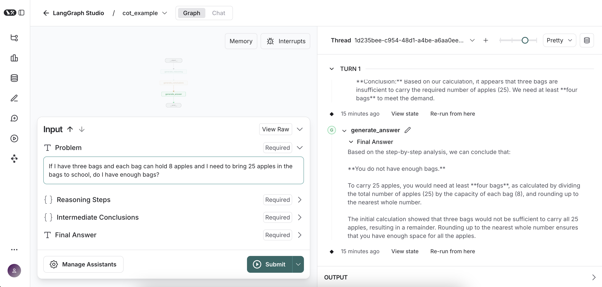
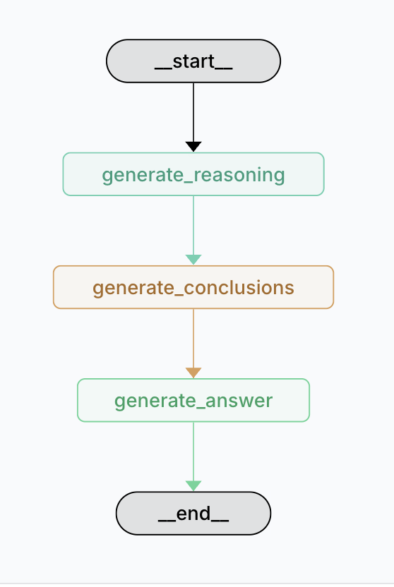

# Simple LangGraph Example: Chain-of-Thought Prompting

## Overview

* This sample code supports the related project on [Agentic AI Design Patterns](../../../../../wiki). Details for the Chain-Of-Thought Prompting pattern can be found [here](../../../../../wiki/Chain‐of‐Thought-Prompting).
* This simple program demonstrates using LangGraph to break a problem down into a series of reasoning steps in order to solve it.
* See [this doc](../../../README.md) for more information on required tools and installations.

## Setup and Run

Follow these steps to set up and run the graph program:
* Install [Docker Desktop](https://www.docker.com/products/docker-desktop/) and run it
* Install [Ollama](https://ollama.com/) and run it
```
ollama serve
```
* Install [LangGraph Studio](https://studio.langchain.com/)
* Move to the ./src directory, create a virutal env and install the required libraries:
```
# Full path: /ai-agent-design-patterns/src/core-processing/chain-of-thought-prompting/simple-langgraph/src
cd src
python3 -m venv venv
source venv/bin/activate
pip install -r requirements.txt
```
* Run the LangGraph Studio command line which will launch LangGraph Studio in a browser tab.
```
langgraph dev
```
> I have had to close my terminal window and open a new terminal after installing langgraph-cli[inmem]

* Enter your query in the Query field in LangGraph Studio and click the Submit button.



## More Info

This is a diagram of the graph defined by this program:



